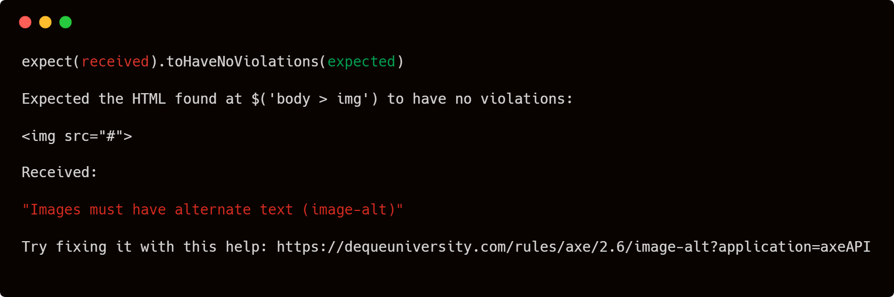

# jest-axe

## Installation

```bash
npm install --save-dev jest-axe
```

## Usage

```javascript
const { axe, toHaveNoViolations } = require('jest-axe')

expect.extend(toHaveNoViolations)

it('should demonstrate this matcher`s usage', async () => {
  const render = () => ''

  // pass anything that outputs html to axe
  const html = render()

  expect(await axe(html)).toHaveNoViolations()
})
```



> Note, you can also require `'jest-axe/extend-expect'` which will call `expect.extend` for you.
> This is especially helpful when using the jest `setupTestFrameworkScriptFile` configuration.

### Testing React

```javascript
const React = require('react')
const { render } =  require('react-dom')
const App = require('./app')

const { axe, toHaveNoViolations } = require('jest-axe')
expect.extend(toHaveNoViolations)

it('should demonstrate this matcher`s usage with react', async () => {
  render(<App/>, document.body)
  const results = await axe(document.body)
  expect(results).toHaveNoViolations()
})
```

### Testing React with [Enzyme](https://airbnb.io/enzyme/)

```javascript
const React = require('react')
const App = require('./app')

const { mount } = require('enzyme')
const { axe, toHaveNoViolations } = require('jest-axe')
expect.extend(toHaveNoViolations)

it('should demonstrate this matcher`s usage with enzyme', async () => {
  const wrapper = mount(<App/>)
  const results = await axe(wrapper.getDOMNode())
  
  expect(results).toHaveNoViolations()
})
```

### Testing React with [React Testing Library](https://testing-library.com/docs/react-testing-library/intro)

```javascript
const React = require('react')
const App = require('./app')

const { render, cleanup } = require('@testing-library/react')
const { axe, toHaveNoViolations } = require('jest-axe')
expect.extend(toHaveNoViolations)

it('should demonstrate this matcher`s usage with react testing library', async () => {
  const { container } = render(<App/>)
  const results = await axe(container)
  
  expect(results).toHaveNoViolations()
  
  cleanup()
})
```

> Note: If you're using `react testing library` you should be using the
> [`cleanup`](https://testing-library.com/docs/react-testing-library/api#cleanup) method. This method removes the rendered application from the DOM and ensures a clean HTML Document for further testing.

### Testing Vue with [Vue Test Utils](https://vue-test-utils.vuejs.org/)

```javascript
const App = require('./App.vue')

const { mount } = require('@vue/test-utils')
const { axe, toHaveNoViolations } = require('jest-axe')
expect.extend(toHaveNoViolations)

it('should demonstrate this matcher`s usage with vue test utils', async () => {
  const wrapper = mount(Image)
  const results = await axe(wrapper.element)

  expect(results).toHaveNoViolations()
})
```

### Testing Vue with [Vue Testing Library](https://testing-library.com/docs/vue-testing-library/intro)

```javascript
const React = require('react')
const App = require('./app')

const { render, cleanup } = require('@testing-library/vue')
const { axe, toHaveNoViolations } = require('jest-axe')
expect.extend(toHaveNoViolations)

it('should demonstrate this matcher`s usage with react testing library', async () => {
  const { container } = render(<App/>)
  const results = await axe(container)
  
  expect(results).toHaveNoViolations()
  
  cleanup()
})
```

> Note: If you're using `vue testing library` you should be using the
> [`cleanup`](https://testing-library.com/docs/vue-testing-library/api#cleanup) method. This method removes the rendered application from the DOM and ensures a clean HTML Document for further testing.

### Axe configuration

The `axe` function allows options to be set with the [same options as documented in axe-core](https://github.com/dequelabs/axe-core/blob/develop-2x/doc/API.md#options-parameter):

```javascript
const { axe, toHaveNoViolations } = require('jest-axe')

expect.extend(toHaveNoViolations)

it('should demonstrate this matcher`s usage with a custom config', async () => {
  const render = () => `
    <div>
      
    </div>
  `

  // pass anything that outputs html to axe
  const html = render()

  const results = await axe(html, {
    rules: {
      // for demonstration only, don't disable rules that need fixing.
      'image-alt': { enabled: false }
    }
  })

  expect(results).toHaveNoViolations()
})
```

## Setting global configuration

If you find yourself repeating the same options multiple times, you can export a version of the `axe` function with defaults set.

Note: You can still pass additional options to this new instance; they will be merged with the defaults.

This could be done in [Jest's setup step](https://facebook.github.io/jest/docs/en/setup-teardown.html)

```javascript
// Global helper file (axe-helper.js)
const { configureAxe } = require('jest-axe')

const axe = configureAxe({
  rules: {
    // for demonstration only, don't disable rules that need fixing.
    'image-alt': { enabled: false }
  }
})

module.exports = axe
```

```javascript
// Individual test file (test.js)
const { toHaveNoViolations } = require('jest-axe')
const axe = require('./axe-helper.js')

expect.extend(toHaveNoViolations)

it('should demonstrate this matcher`s usage with a default config', async () => {
  const render = () => `
    <div>
      
    </div>
  `

  // pass anything that outputs html to axe
  const html = render()

  expect(await axe(html)).toHaveNoViolations()
})
```
